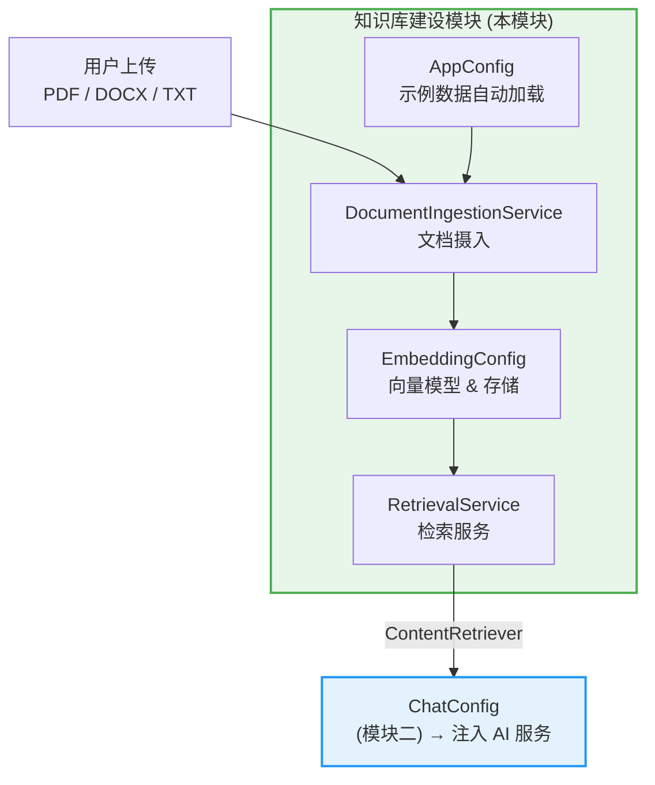
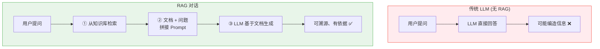
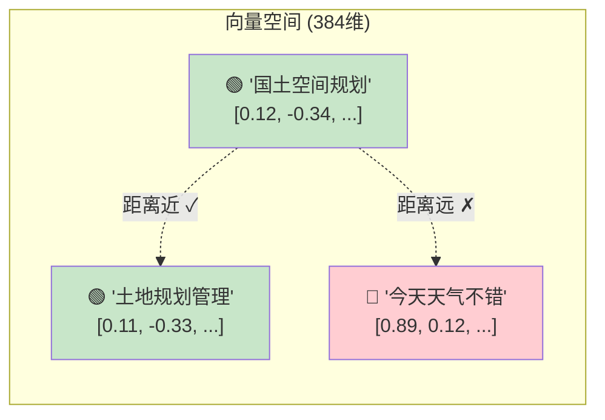
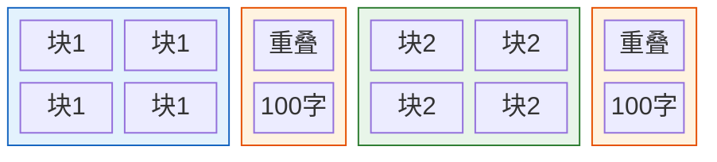
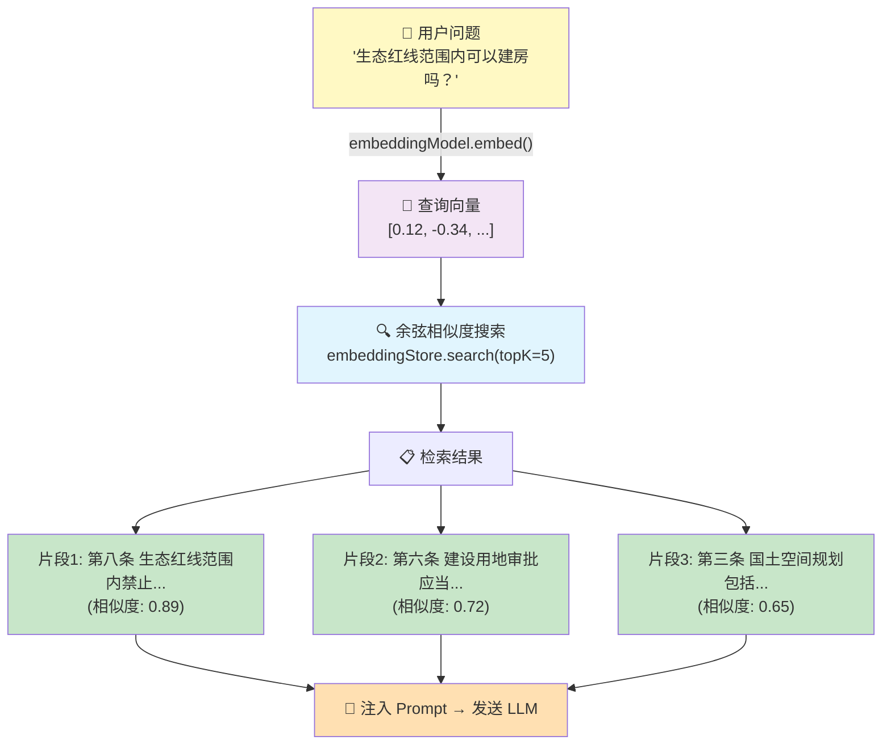
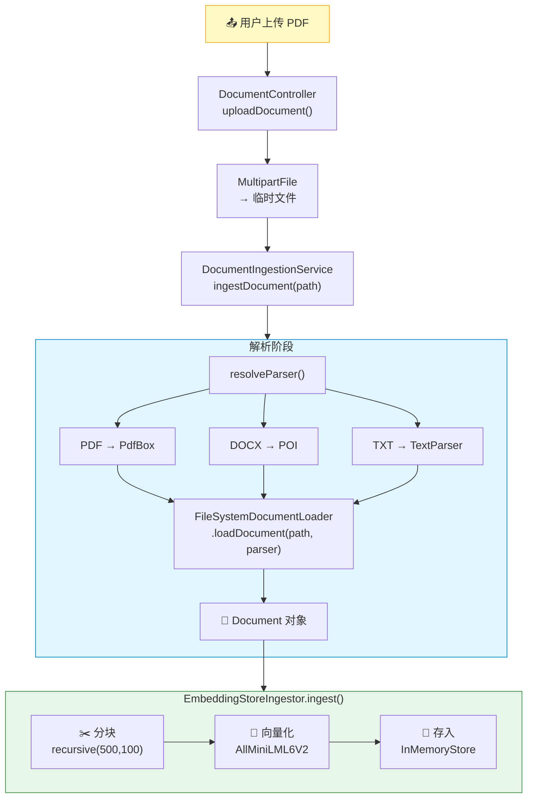
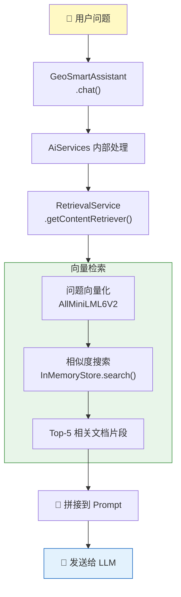
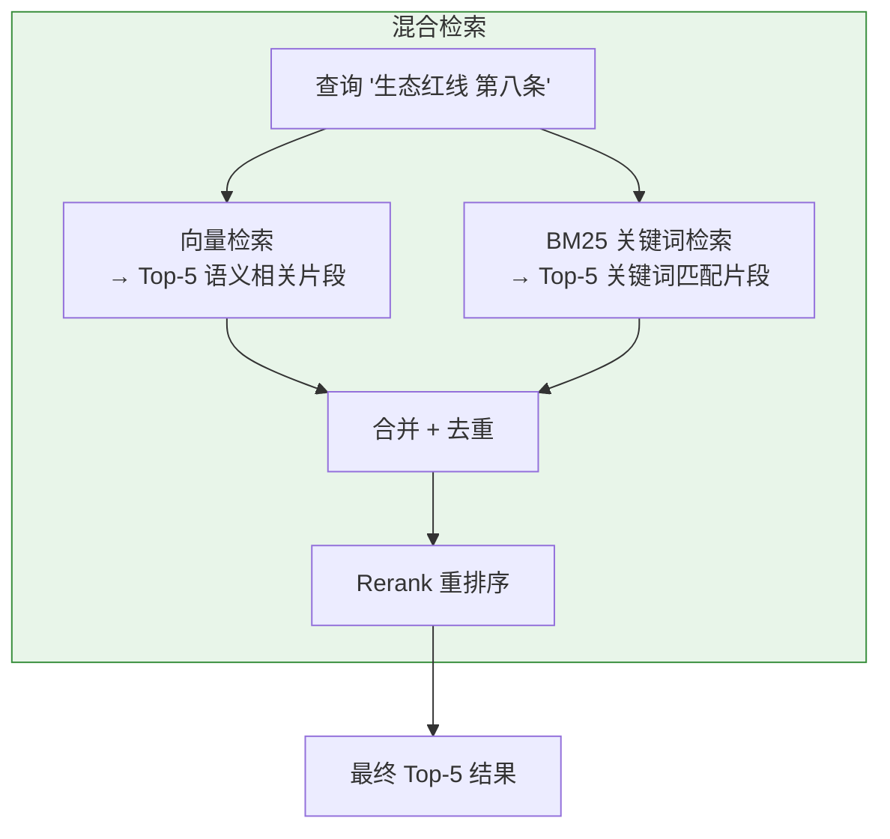

# 模块一：知识库建设 — 学习指南

本模块实现 RAG（检索增强生成）的完整管道：文档解析 → 文本分块 → 向量化 → 存储 → 检索。

---

## 目录

1. [模块总览](#1-模块总览)
2. [前置知识](#2-前置知识)
3. [源码详解](#3-源码详解)
4. [数据流全景](#4-数据流全景)
5. [配置详解](#5-配置详解)
6. [动手练习](#6-动手练习)
7. [扩展方向](#7-扩展方向)

---

## 1. 模块总览

### 模块定位



### 涉及文件

| 文件 | 路径 | 职责 |
|------|------|------|
| `DocumentIngestionService.java` | `backend/.../rag/` | 文档解析、分块、入库 |
| `EmbeddingConfig.java` | `backend/.../rag/` | 向量模型和向量存储的 Bean 配置 |
| `RetrievalService.java` | `backend/.../rag/` | 构建内容检索器供 AI 服务使用 |
| `AppConfig.java` | `backend/.../config/` | 启动时自动加载示例文档 |
| `application.yml` | `backend/.../resources/` | RAG 参数配置 |
| `land-use-regulation.txt` | `backend/.../resources/sample-docs/` | 示例法规语料 |

---

## 2. 前置知识

### 2.1 什么是 RAG

RAG（Retrieval-Augmented Generation，检索增强生成）解决了一个核心问题：**LLM 的知识是静态的，无法回答私有领域问题**。



### 2.2 什么是向量嵌入（Embedding）

将文本转换为一组浮点数（向量），语义相近的文本在向量空间中距离更近。



项目使用 **AllMiniLmL6V2** 模型（384 维，本地 ONNX 推理，无需网络）。

### 2.3 什么是文本分块（Chunking）

将长文档切成小段落，每个段落单独向量化。分块太小会丢失上下文，太大会引入噪声。



**重叠（Overlap）** 的作用：保证跨块边界的信息不被切断。

### 2.4 相关 Maven 依赖

```xml
<!-- pom.xml 中的 RAG 相关依赖 -->

<!-- LangChain4j 核心 -->
<dependency>
    <groupId>dev.langchain4j</groupId>
    <artifactId>langchain4j</artifactId>
    <version>1.13.0</version>
</dependency>

<!-- 本地向量模型 (ONNX 推理) -->
<dependency>
    <groupId>dev.langchain4j</groupId>
    <artifactId>langchain4j-embeddings-all-minilm-l6-v2</artifactId>
    <version>1.13.0-beta23</version>
</dependency>

<!-- PDF 解析 -->
<dependency>
    <groupId>dev.langchain4j</groupId>
    <artifactId>langchain4j-document-parser-apache-pdfbox</artifactId>
    <version>1.13.0-beta23</version>
</dependency>

<!-- DOCX 解析 -->
<dependency>
    <groupId>dev.langchain4j</groupId>
    <artifactId>langchain4j-document-parser-apache-poi</artifactId>
    <version>1.13.0-beta23</version>
</dependency>
```

**注意**：向量模型和文档解析器属于 LangChain4j 的 beta 模块，版本号带 `-beta23` 后缀。

---

## 3. 源码详解

### 3.1 EmbeddingConfig — 向量基础设施

**文件**: `backend/src/main/java/com/geosmart/rag/EmbeddingConfig.java`

```java
@Configuration
public class EmbeddingConfig {

    @Bean
    public EmbeddingModel embeddingModel() {
        // AllMiniLmL6V2: 轻量级句子向量模型
        // - 输出维度: 384
        // - 推理方式: 本地 ONNX，无需网络
        // - 适合场景: 英文为主，中文也可用（效果略弱于专用中文模型）
        return new AllMiniLmL6V2EmbeddingModel();
    }

    @Bean
    public EmbeddingStore<TextSegment> embeddingStore() {
        // InMemoryEmbeddingStore: 纯内存存储
        // - 优点: 零配置，启动即用
        // - 缺点: 重启丢失，不适合大规模数据
        // - 生产环境应替换为 Milvus / pgvector
        return new InMemoryEmbeddingStore<>();
    }
}
```

**关键概念**：
- `EmbeddingModel` — 负责将文本转为向量。接口抽象，可替换为远程 API（如 OpenAI Embeddings）
- `EmbeddingStore<TextSegment>` — 向量存储。泛型参数 `TextSegment` 表示存的是文本片段
- `InMemoryEmbeddingStore` — LangChain4j 内置的内存向量库，使用余弦相似度检索

**设计决策**：
- 选择本地模型而非 API，是因为国土数据有安全要求，数据不能出网
- 选择 `InMemoryEmbeddingStore` 是 MVP 阶段的简化选择，后续可无缝替换

### 3.2 DocumentIngestionService — 文档摄入服务

**文件**: `backend/src/main/java/com/geosmart/rag/DocumentIngestionService.java`

```java
@Service
public class DocumentIngestionService {

    private final EmbeddingStoreIngestor ingestor;

    public DocumentIngestionService(
            EmbeddingStore<TextSegment> store,      // Spring 注入的内存向量库
            EmbeddingModel embeddingModel,            // Spring 注入的向量模型
            @Value("${rag.chunk-size:500}") int chunkSize,
            @Value("${rag.chunk-overlap:100}") int chunkOverlap) {

        // EmbeddingStoreIngestor 是 LangChain4j 的一站式摄入器
        // 它内部完成了: 文档 → 分块 → 向量化 → 存储 的完整流程
        this.ingestor = EmbeddingStoreIngestor.builder()
                .embeddingStore(store)
                .embeddingModel(embeddingModel)
                .documentSplitter(
                    DocumentSplitters.recursive(chunkSize, chunkOverlap))
                .build();
    }
```

**`EmbeddingStoreIngestor` 的工作流程**：


**`DocumentSplitters.recursive()` 递归分块策略**：
- 优先按段落（`\n\n`）分割
- 段落过长则按句子（`.!?。！？`）分割
- 句子过长则按字符分割
- 保证每个块不超过 `chunkSize`，相邻块有 `chunkOverlap` 重叠

```java
    public void ingestDocument(Path documentPath) {
        String fileName = documentPath.getFileName().toString();
        // 1. 根据文件扩展名选择解析器
        DocumentParser parser = resolveParser(fileName);
        // 2. 使用解析器加载文档
        Document document = FileSystemDocumentLoader.loadDocument(documentPath, parser);
        // 3. 一键摄入（分块 → 向量化 → 存储）
        ingestor.ingest(document);
        log.info("Ingested document: {} ({} chars)", fileName, document.text().length());
    }

    private DocumentParser resolveParser(String fileName) {
        if (fileName.endsWith(".pdf")) {
            return new ApachePdfBoxDocumentParser();       // PDF → PDFBox
        } else if (fileName.endsWith(".docx") || fileName.endsWith(".doc")) {
            return new ApachePoiDocumentParser();           // DOCX → POI
        } else {
            return new TextDocumentParser();                // TXT → 纯文本
        }
    }
}
```

**LangChain4j 文档解析器对照**：

| 格式 | 解析器类 | 底层库 | 支持的内容 |
|------|----------|--------|-----------|
| `.pdf` | `ApachePdfBoxDocumentParser` | Apache PDFBox | 提取文本、表格 |
| `.docx/.doc` | `ApachePoiDocumentParser` | Apache POI | 提取文本、段落、表格 |
| `.txt` | `TextDocumentParser` | 无 | 纯文本原样读取 |

### 3.3 RetrievalService — 检索服务

**文件**: `backend/src/main/java/com/geosmart/rag/RetrievalService.java`

```java
@Service
public class RetrievalService {

    private final ContentRetriever contentRetriever;

    public RetrievalService(
            EmbeddingStore<TextSegment> store,
            EmbeddingModel embeddingModel,
            @Value("${rag.max-results:5}") int maxResults) {

        // EmbeddingStoreContentRetriever: 基于向量相似度的内容检索器
        this.contentRetriever = EmbeddingStoreContentRetriever.builder()
                .embeddingStore(store)          // 从哪个向量库检索
                .embeddingModel(embeddingModel)  // 用什么模型把查询向量化
                .maxResults(maxResults)          // 返回最相关的 N 个片段
                .build();
    }

    public ContentRetriever getContentRetriever() {
        return contentRetriever;
    }
}
```

**检索流程**：



**`ContentRetriever` 接口的作用**：
- 它是 LangChain4j RAG 的核心接口
- `AiServices` 在构建时会自动调用它
- 每次用户提问时，它会先检索相关文档，再拼接到 prompt 中发给 LLM

### 3.4 AppConfig — 示例数据自动加载

**文件**: `backend/src/main/java/com/geosmart/config/AppConfig.java`

```java
@Configuration
public class AppConfig {

    @Bean
    public CommandLineRunner loadSampleDocuments(
            DocumentIngestionService ingestionService) {
        return args -> {
            // 扫描 src/main/resources/sample-docs/ 目录
            Path sampleDir = Path.of("src/main/resources/sample-docs");
            if (Files.exists(sampleDir)) {
                try (var stream = Files.list(sampleDir)) {
                    stream.filter(Files::isRegularFile)
                          .forEach(file -> {
                              try {
                                  ingestionService.ingestDocument(file);
                                  log.info("Loaded sample document: {}",
                                           file.getFileName());
                              } catch (Exception e) {
                                  log.warn("Failed to load sample document: {}",
                                           file.getFileName(), e);
                              }
                          });
                }
            }
        };
    }
}
```

**`CommandLineRunner` 机制**：
- Spring Boot 启动完成后自动执行
- 常用于数据初始化、缓存预热等
- 这里在启动时自动将 `sample-docs/` 下的文档入库

**示例语料** (`land-use-regulation.txt`)：包含 10 条国土空间规划管理办法，涵盖总则、规划编制、用地审批、监督管理四个章节。

---

## 4. 数据流全景

### 4.1 文档摄入流（写路径）



### 4.2 知识检索流（读路径）



---

## 5. 配置详解

### application.yml 中的 RAG 配置

```yaml
rag:
  chunk-size: 500       # 每个文本块的最大字符数
  chunk-overlap: 100    # 相邻块的重叠字符数
  max-results: 5        # 检索时返回的最相关文档数
```

### 参数调优指南

| 参数 | 默认值 | 调大效果 | 调小效果 | 建议范围 |
|------|--------|---------|---------|---------|
| `chunk-size` | 500 | 更多上下文，但可能引入噪声 | 更精准，但可能丢失上下文 | 300-1000 |
| `chunk-overlap` | 100 | 更好的上下文衔接，但增加存储 | 更高效，但可能切断语义 | 50-200 |
| `max-results` | 5 | 更多参考资料，但 prompt 更长 | 更精炼，但可能遗漏 | 3-10 |

### 向量模型选型参考

| 模型 | 维度 | 语言 | 推理方式 | 适用场景 |
|------|------|------|---------|---------|
| AllMiniLmL6V2 | 384 | 英文为主 | 本地 ONNX | MVP、原型验证 |
| BGE-small-zh | 512 | 中文 | 本地/远程 | 中文优化 |
| OpenAI text-embedding-3-small | 1536 | 多语言 | API 调用 | 效果最好但有成本 |

---

## 6. 动手练习

### 练习 1：上传文档并验证检索

**目标**：验证 RAG 管道端到端工作。

```bash
# 1. 启动后端
cd backend && mvn spring-boot:run

# 2. 观察启动日志，确认示例文档加载
# 应看到: "Loaded sample document: land-use-regulation.txt"

# 3. 上传自定义文档
curl -X POST http://localhost:8080/api/documents/upload \
  -F "file=@my-regulation.txt"

# 4. 通过聊天接口测试检索效果
curl -X POST http://localhost:8080/api/chat \
  -H "Content-Type: application/json" \
  -d '{"message":"生态红线范围内禁止什么活动？","sessionId":"test-rag"}'
```

### 练习 2：调整分块参数观察效果

**目标**：理解分块参数对检索质量的影响。

1. 将 `chunk-size` 改为 `200`，重启后端，问一个具体问题，观察回答
2. 将 `chunk-size` 改为 `1000`，重启后端，问同样的问题
3. 对比两次回答的准确性和完整性

### 练习 3：添加检索日志

**目标**：可视化检索过程，理解 LLM 拿到了什么参考文档。

在 `RetrievalService` 中添加日志：

```java
public ContentRetriever getContentRetriever() {
    // 包装原始 retriever，添加日志
    return query -> {
        var contents = contentRetriever.retrieve(query);
        contents.forEach(c ->
            log.info("RAG Retrieved (score={}): {}...",
                c.score(),
                c.textSegment().text().substring(0,
                    Math.min(100, c.textSegment().text().length()))));
        return contents;
    };
}
```

### 练习 4：支持新的文档格式

**目标**：理解 LangChain4j 的解析器扩展机制。

1. 在 `pom.xml` 中添加 `langchain4j-document-parser-apache-tika` 依赖
2. 在 `resolveParser()` 中增加对 `.xlsx`、`.pptx` 的支持
3. 上传一个 Excel 文件验证

---

## 7. 扩展方向

### 7.1 向量数据库升级

当前 `InMemoryEmbeddingStore` 仅适合开发。生产环境推荐：

| 方案 | 改动量 | 适用场景 |
|------|--------|---------|
| Milvus | 仅改 `EmbeddingConfig` Bean | 大规模、高性能 |
| pgvector | 仅改 `EmbeddingConfig` Bean | 已有 PostgreSQL |
| Qdrant | 仅改 `EmbeddingConfig` Bean | 中小规模、易运维 |

```java
// 示例：切换到 Milvus（仅修改 EmbeddingConfig）
@Bean
public EmbeddingStore<TextSegment> embeddingStore(MilvusClient client) {
    return MilvusEmbeddingStore.builder()
            .milvusClient(client)
            .collectionName("geosmart_docs")
            .dimension(384)
            .build();
}
```

### 7.2 混合检索 (Hybrid Search)

当前仅语义检索。混合检索结合 BM25 关键词匹配，可提升准确率：



### 7.3 元数据过滤

为每个 `TextSegment` 附加元数据（文件名、章节、发布日期），检索时过滤：

```java
// 摄入时添加元数据
TextSegment segment = TextSegment.from(
    text,
    Metadata.from("source", "land-use-regulation.txt")
             .add("chapter", "第三章")
             .add("date", "2024-01-01")
);

// 检索时过滤
EmbeddingStoreContentRetriever.builder()
    .filter(source.equals("land-use-regulation.txt"))
    .build();
```
