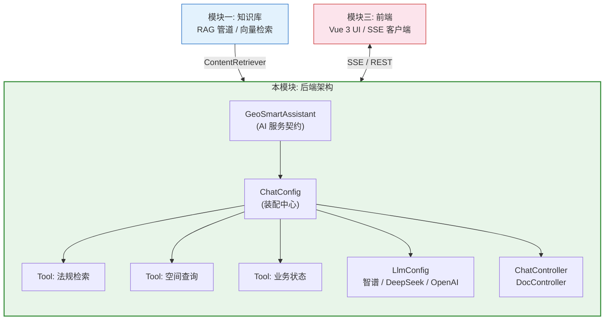
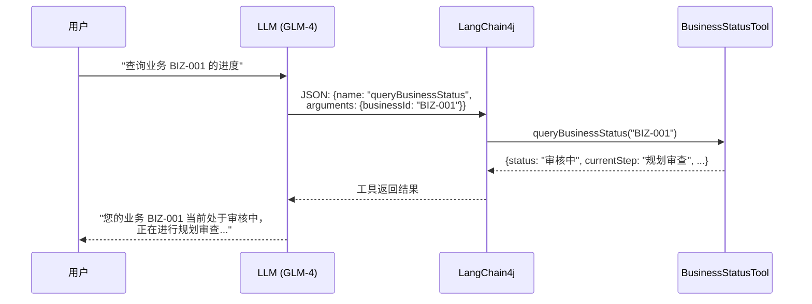
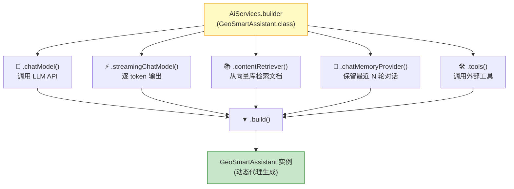
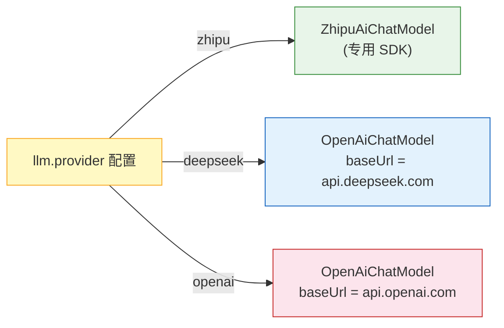
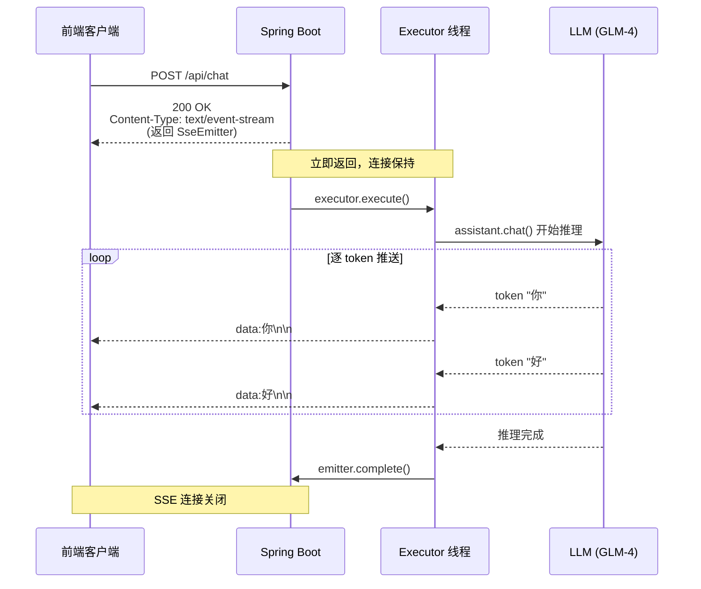
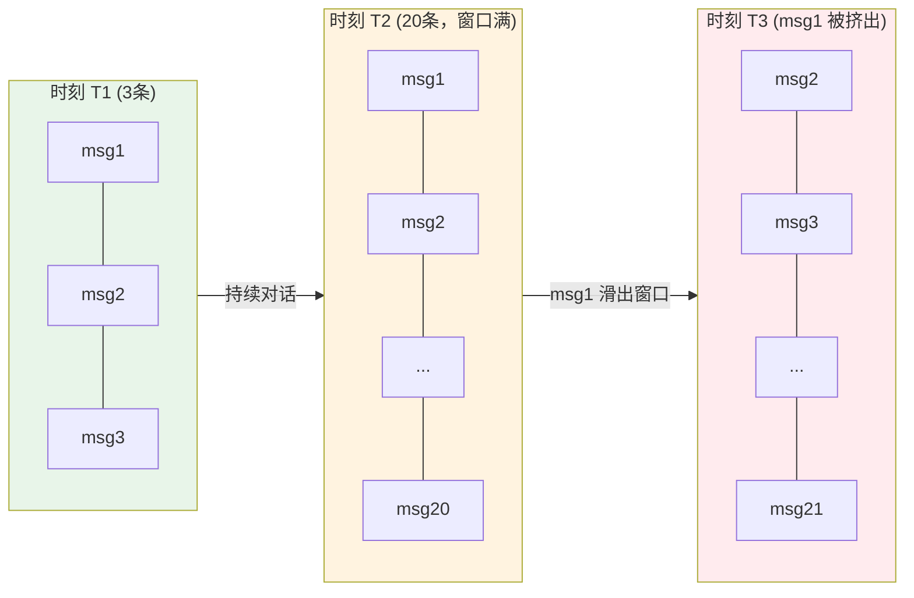
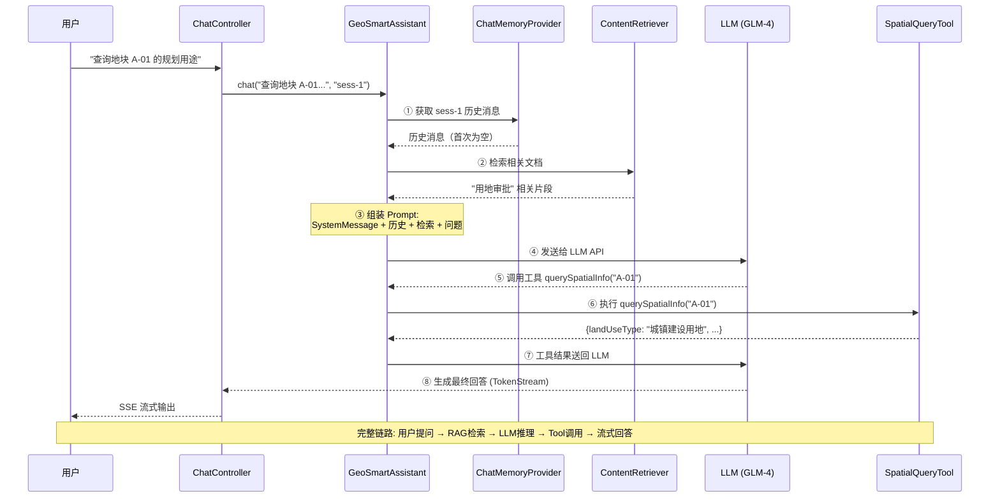
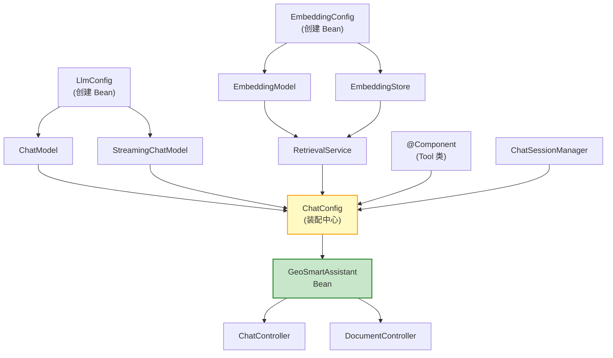

# 模块二：后端架构搭建 — 学习指南

本模块构建 AI 应用的后端骨架：LangChain4j AI 服务装配、Agent 工具定义、LLM 多提供商切换、SSE 流式控制器、会话管理。

---

## 目录

1. [模块总览](#1-模块总览)
2. [前置知识](#2-前置知识)
3. [源码详解 — AI 服务层](#3-源码详解--ai-服务层)
4. [源码详解 — Agent 工具层](#4-源码详解--agent-工具层)
5. [源码详解 — LLM 配置层](#5-源码详解--llm-配置层)
6. [源码详解 — API 控制层](#6-源码详解--api-控制层)
7. [源码详解 — 会话管理层](#7-源码详解--会话管理层)
8. [核心协作关系](#8-核心协作关系)
9. [动手练习](#9-动手练习)
10. [扩展方向](#10-扩展方向)

---

## 1. 模块总览

### 模块定位



### 涉及文件

| 文件 | 路径 | 职责 |
|------|------|------|
| `GeoSmartAssistant.java` | `chat/` | AI 服务接口（系统提示词 + 调用契约） |
| `ChatConfig.java` | `chat/` | 核心装配：将 LLM、工具、RAG、记忆组装成 AI 服务 |
| `ChatSessionManager.java` | `chat/` | 会话管理：创建/清除/存储对话记忆 |
| `LlmConfig.java` | `llm/` | LLM 提供商切换（策略模式） |
| `LlmProperties.java` | `llm/` | LLM 配置属性绑定 |
| `ChatController.java` | `api/` | SSE 流式聊天端点 |
| `DocumentController.java` | `api/` | 文档上传端点 |
| `RegulationSearchTool.java` | `agent/tools/` | 法规检索工具 |
| `SpatialQueryTool.java` | `agent/tools/` | 空间查询工具 |
| `BusinessStatusTool.java` | `agent/tools/` | 业务状态查询工具 |

---

## 2. 前置知识

### 2.1 LangChain4j AiService 模式

LangChain4j 的核心设计思想：**用接口定义 AI 服务，框架自动生成实现**。

```java
// 开发者只写接口
@SystemMessage("你是助手...")
public interface MyAssistant {
    TokenStream chat(@UserMessage String msg, @MemoryId String id);
}

// 框架自动生成实现（动态代理）
MyAssistant assistant = AiServices.builder(MyAssistant.class)
    .chatModel(model)
    .tools(tool1, tool2)
    .contentRetriever(retriever)
    .build();

// 调用就像普通方法
assistant.chat("你好", "session-1");
```

**为什么用接口而非类**：
- 声明式编程：只定义"做什么"（契约），不管"怎么做"（实现）
- 框架通过动态代理生成实现类，开发者不写任何胶水代码
- 注解（`@SystemMessage`、`@Tool`、`@MemoryId`）是框架的 DSL

### 2.2 Tool Calling（工具调用）原理

LLM 本身不能执行代码。Tool Calling 的流程是：



关键：LLM 只输出"调用意图"，不直接执行代码。

### 2.3 SSE（Server-Sent Events）

```
传统 HTTP: 请求 → 等待 → 一次性返回完整响应
SSE:       请求 → 连接保持 → 服务端持续推送数据块

后端发送格式:
  data:今\n\n
  data:天\n\n
  data:天\n\n
  data:气\n\n
  data:[DONE]\n\n

前端逐块读取，实现"打字机"效果。
```

### 2.4 相关 Maven 依赖

```xml
<!-- LLM 提供商 -->
<dependency>
    <groupId>dev.langchain4j</groupId>
    <artifactId>langchain4j-open-ai</artifactId>         <!-- OpenAI 兼容接口 -->
</dependency>
<dependency>
    <groupId>dev.langchain4j</groupId>
    <artifactId>langchain4j-community-zhipu-ai</artifactId> <!-- 智谱 GLM -->
</dependency>

<!-- Lombok (简化 Java 代码) -->
<dependency>
    <groupId>org.projectlombok</groupId>
    <artifactId>lombok</artifactId>
</dependency>
```

---

## 3. 源码详解 — AI 服务层

### 3.1 GeoSmartAssistant — AI 服务契约

**文件**: `backend/src/main/java/com/geosmart/chat/GeoSmartAssistant.java`

```java
public interface GeoSmartAssistant {

    @SystemMessage("""
            你是「国土空间规划智能助手」，专门帮助用户解答国土空间规划
            相关的政策法规问题，以及查询土地空间信息和业务办理状态。

            你的职责：
            1. 政策法规咨询：回答关于国土空间规划法律法规的问题，
               引用政策时需注明文件名称。
            2. 空间信息查询：查询指定区域的土地性质、规划用途、
               红线范围等信息。
            3. 业务办理查询：查询规划许可、用地审批等业务的办理进度。

            回答要求：
            - 专业准确，引用政策文件需注明文件名称和文号。
            - 如果不确定，请如实告知，不要编造信息。
            - 使用清晰、简洁的中文回答。
            """)
    TokenStream chat(@UserMessage String message,
                     @MemoryId String sessionId);
}
```

**注解解析**：

| 注解 | 作用 | 类比 |
|------|------|------|
| `@SystemMessage` | 定义 AI 角色和行为规范 | 员工的岗位职责说明书 |
| `@UserMessage` | 标记用户输入参数 | 客户的需求描述 |
| `@MemoryId` | 标记会话 ID | 工单号，区分不同客户 |

**返回值 `TokenStream`**：
- LangChain4j 的流式返回类型
- 通过 `.onPartialResponse()`、`.onCompleteResponse()`、`.onError()` 注册回调
- 调用 `.start()` 开始流式输出

**系统提示词设计原则**：
- 明确角色定位（国土规划智能助手）
- 列出具体职责（3 项）
- 给出行为约束（引用来源、不编造）
- 后续扩展只需修改此处文本

### 3.2 ChatConfig — 核心装配中心

**文件**: `backend/src/main/java/com/geosmart/chat/ChatConfig.java`

这是整个 AI 后端最关键的文件，所有组件在此汇合：

```java
@Configuration
public class ChatConfig {

    @Bean
    public GeoSmartAssistant geoSmartAssistant(
            ChatModel chatLanguageModel,           // ① LLM（来自 LlmConfig）
            StreamingChatModel streamingChatModel,  // ② 流式 LLM
            RetrievalService retrievalService,      // ③ RAG 检索（来自模块一）
            ChatSessionManager sessionManager,       // ④ 会话管理
            RegulationSearchTool regulationSearchTool, // ⑤ 工具1
            SpatialQueryTool spatialQueryTool,       // ⑥ 工具2
            BusinessStatusTool businessStatusTool    // ⑦ 工具3
    ) {
        return AiServices.builder(GeoSmartAssistant.class)
                .chatModel(chatLanguageModel)               // 注入 LLM
                .streamingChatModel(streamingChatModel)      // 注入流式 LLM
                .contentRetriever(retrievalService           // 注入 RAG
                    .getContentRetriever())
                .chatMemoryProvider(memoryId ->              // 注入会话记忆
                    sessionManager.getOrCreate(memoryId.toString()))
                .tools(regulationSearchTool,                 // 注入工具集
                       spatialQueryTool,
                       businessStatusTool)
                .build();
    }
}
```

**装配图解**：



**`chatMemoryProvider` 的工作方式**：
- 是一个工厂函数：`memoryId → ChatMemory`
- 每个 `sessionId` 对应一个独立的 `ChatMemory`
- 首次访问时创建，后续复用

---

## 4. 源码详解 — Agent 工具层

### 4.1 工具通用结构

每个工具都是一个 Spring `@Component`，方法上标注 `@Tool`：

```
@Component                  →  Spring 自动扫描和注入
@Tool("功能描述")           →  LLM 看到这段描述来决定何时调用
@P("参数说明")              →  帮助 LLM 正确传参
返回 String (JSON)          →  结构化返回，LLM 更容易理解
```

### 4.2 RegulationSearchTool — 法规检索工具

**文件**: `backend/src/main/java/com/geosmart/agent/tools/RegulationSearchTool.java`

```java
@Component
public class RegulationSearchTool {

    @Tool("根据关键词检索国土空间规划相关法规政策文件，返回匹配的法规名称、文号和摘要")
    public String searchRegulations(
            @P("搜索关键词，如：国土空间规划、用地审批、生态红线") String keyword) {

        // 当前返回模拟数据（硬编码 JSON）
        return """
                {
                  "total": 2,
                  "regulations": [
                    {
                      "name": "《国土空间规划法》",
                      "docNumber": "国发〔2024〕XX号",
                      "summary": "规定了国土空间规划的编制、审批、实施和监督管理...与「%s」高度相关。",
                      "effectiveDate": "2024-01-01"
                    },
                    {
                      "name": "《建设用地审批管理办法》",
                      "docNumber": "自然资发〔2023〕XX号",
                      "summary": "规范了建设用地的申请、审查、批准程序...包含「%s」相关条款。",
                      "effectiveDate": "2023-06-01"
                    }
                  ]
                }
                """.formatted(keyword, keyword);
    }
}
```

### 4.3 SpatialQueryTool — 空间查询工具

**文件**: `backend/src/main/java/com/geosmart/agent/tools/SpatialQueryTool.java`

```java
@Component
public class SpatialQueryTool {

    @Tool("查询指定区域或地块的空间规划信息，包括土地性质、规划用途、红线范围等")
    public String querySpatialInfo(
            @P("区域名称或地块编号，如：滨江新城、A-01地块") String location) {

        return """
                {
                  "location": "%s",
                  "spatialInfo": {
                    "landUseType": "城镇建设用地",
                    "planningPurpose": "商住混合用地",
                    "redlineStatus": "未涉及生态红线",
                    "zoning": "城市更新改造区",
                    "floorAreaRatio": "≤3.5",
                    "buildingDensity": "≤35%%",
                    "greeningRate": "≥30%%",
                    "restrictions": ["需进行环境影响评价", "符合城市总体规划要求"]
                  }
                }
                """.formatted(location);
    }
}
```

### 4.4 BusinessStatusTool — 业务状态工具

**文件**: `backend/src/main/java/com/geosmart/agent/tools/BusinessStatusTool.java`

```java
@Component
public class BusinessStatusTool {

    @Tool("查询业务办理状态，如规划许可证、用地审批、建设工程规划许可等")
    public String queryBusinessStatus(
            @P("业务编号，如：GH-2024-001") String businessId) {

        return """
                {
                  "businessId": "%s",
                  "businessType": "建设工程规划许可证",
                  "status": "审核中",
                  "currentStep": "规划审查",
                  "totalSteps": 5,
                  "completedSteps": 3,
                  "applicant": "XX开发有限公司",
                  "submitDate": "2024-03-15",
                  "estimatedCompletionDate": "2024-05-01",
                  "nextStep": "公示阶段",
                  "remarks": "已通过专家评审，待公示"
                }
                """.formatted(businessId);
    }
}
```

### 4.5 工具设计要点

| 要素 | 当前状态 | 生产要求 |
|------|---------|---------|
| **返回数据** | 硬编码模拟 | 接入真实数据库/API |
| **权限校验** | 未实现 | 必须校验当前用户 Session |
| **数据脱敏** | 未实现 | 返回前剔除 phone、idCard 等 |
| **错误处理** | 无异常 | try-catch + 友好错误消息 |
| **描述质量** | 已规范 | 需持续优化以改善 LLM 触发准确率 |

### 4.6 新增工具的标准步骤

```
1. 创建 @Component 类
2. 编写 @Tool 方法（返回 JSON 字符串）
3. 在 ChatConfig.tools() 参数中添加（Spring 自动注入）
4. 编写单元测试
5. 联调验证 LLM 能正确触发
```

---

## 5. 源码详解 — LLM 配置层

### 5.1 LlmProperties — 类型安全配置

**文件**: `backend/src/main/java/com/geosmart/llm/LlmProperties.java`

```java
@Data
@ConfigurationProperties(prefix = "llm")
public class LlmProperties {

    private String provider = "zhipu";               // 当前激活的提供商
    private ProviderConfig deepseek = new ProviderConfig();
    private ProviderConfig openai = new ProviderConfig();
    private ProviderConfig zhipu = new ProviderConfig();

    @Data
    public static class ProviderConfig {
        private String baseUrl;
        private String apiKey;
        private String modelName;
    }

    /** 根据提供商名称返回对应配置 */
    public ProviderConfig getActiveConfig() {
        return switch (provider.toLowerCase()) {
            case "openai" -> openai;
            case "zhipu" -> zhipu;
            default -> deepseek;
        };
    }
}
```

**对应 yml 结构**：

```yaml
llm:
  provider: zhipu                    # ← LlmProperties.provider
  zhipu:                             # ← LlmProperties.zhipu
    base-url: https://open.bigmodel.cn/
    api-key: ${ZHIPU_API_KEY:xxx}
    model-name: glm-4-flash
```

**设计模式**：`@ConfigurationProperties` 将 yml 配置绑定到 Java 对象，比 `@Value` 更适合多层嵌套结构。

### 5.2 LlmConfig — 多提供商策略

**文件**: `backend/src/main/java/com/geosmart/llm/LlmConfig.java`

```java
@Slf4j
@Configuration
@RequiredArgsConstructor
@EnableConfigurationProperties(LlmProperties.class)
public class LlmConfig {

    private final LlmProperties llmProperties;

    @Bean
    public ChatModel chatLanguageModel() {
        LlmProperties.ProviderConfig config = llmProperties.getActiveConfig();
        String provider = llmProperties.getProvider().toLowerCase();

        if ("zhipu".equals(provider)) {
            // 智谱有专用 SDK
            return ZhipuAiChatModel.builder()
                    .apiKey(config.getApiKey())
                    .model(config.getModelName())
                    .build();
        }
        // DeepSeek / OpenAI 都兼容 OpenAI API
        return OpenAiChatModel.builder()
                .baseUrl(config.getBaseUrl())
                .apiKey(config.getApiKey())
                .modelName(config.getModelName())
                .build();
    }

    @Bean
    public StreamingChatModel streamingChatModel() {
        // 同理，流式版本
        // ...
    }
}
```

**策略切换图**：



**关键洞察**：DeepSeek 兼容 OpenAI API 协议，所以复用 `OpenAiChatModel`，只需改 `baseUrl`。

---

## 6. 源码详解 — API 控制层

### 6.1 ChatController — SSE 流式聊天

**文件**: `backend/src/main/java/com/geosmart/api/ChatController.java`

```java
@RestController
@RequestMapping("/api/chat")
@RequiredArgsConstructor
public class ChatController {

    private final ExecutorService executor = Executors.newCachedThreadPool();

    private final GeoSmartAssistant assistant;
    private final ChatSessionManager sessionManager;

    @PostMapping(produces = MediaType.TEXT_EVENT_STREAM_VALUE)
    public SseEmitter chat(@RequestBody ChatRequest request) {
        // 1. 创建 SSE 发射器（超时 120 秒）
        SseEmitter emitter = new SseEmitter(120_000L);

        String sessionId = request.sessionId() != null
            ? request.sessionId() : "default";

        // 2. 在独立线程中执行流式推理（不阻塞 HTTP 线程）
        executor.execute(() -> {
            try {
                TokenStream tokenStream = assistant.chat(
                    request.message(), sessionId);

                tokenStream
                    .onPartialResponse(token -> {
                        // 3. 每收到一个 token，通过 SSE 推送
                        emitter.send(SseEmitter.event().data(token));
                    })
                    .onCompleteResponse(response -> {
                        // 4. 推理完成，关闭 SSE 连接
                        emitter.complete();
                    })
                    .onError(error -> {
                        emitter.completeWithError(error);
                    })
                    .start();  // 5. 启动流式推理
            } catch (Exception e) {
                emitter.completeWithError(e);
            }
        });

        // 6. 立即返回 SseEmitter（HTTP 响应已结束，但连接保持）
        return emitter;
    }
}
```

**SSE 生命周期**：



### 6.2 DocumentController — 文档上传

**文件**: `backend/src/main/java/com/geosmart/api/DocumentController.java`

```java
@RestController
@RequestMapping("/api/documents")
public class DocumentController {

    private final DocumentIngestionService ingestionService;
    private final List<String> uploadedDocuments = new ArrayList<>();

    @PostMapping("/upload")
    public ResponseEntity<Map<String, String>> uploadDocument(
            @RequestParam("file") MultipartFile file) {
        try {
            // 1. 保存上传文件到临时目录
            Path tempFile = Files.createTempFile("doc-", file.getOriginalFilename());
            file.transferTo(tempFile.toFile());

            // 2. 调用摄入服务入库
            ingestionService.ingestDocument(tempFile);

            // 3. 清理临时文件
            Files.deleteIfExists(tempFile);

            // 4. 记录文件名
            uploadedDocuments.add(file.getOriginalFilename());

            return ResponseEntity.ok(Map.of(
                "status", "success",
                "filename", file.getOriginalFilename()));
        } catch (Exception e) {
            return ResponseEntity.internalServerError()
                .body(Map.of("status", "error", "message", e.getMessage()));
        }
    }

    @GetMapping
    public ResponseEntity<Map<String, Object>> listDocuments() {
        return ResponseEntity.ok(Map.of("documents", uploadedDocuments));
    }
}
```

**API 一览**：

| 方法 | 路径 | 请求 | 响应 |
|------|------|------|------|
| POST | `/api/chat` | `{message, sessionId}` | SSE 流 |
| GET | `/api/chat/history/{sessionId}` | - | `{sessionId: "..."}` |
| DELETE | `/api/chat/session/{sessionId}` | - | `{status: "cleared"}` |
| POST | `/api/documents/upload` | `multipart/form-data` | `{status, filename}` |
| GET | `/api/documents` | - | `{documents: [...]}` |

---

## 7. 源码详解 — 会话管理层

### 7.1 ChatSessionManager

**文件**: `backend/src/main/java/com/geosmart/chat/ChatSessionManager.java`

```java
@Component
public class ChatSessionManager {

    private final int maxMessages;
    // ConcurrentHashMap: 线程安全的 Map，支持并发读写
    private final Map<String, ChatMemory> sessions = new ConcurrentHashMap<>();

    public ChatSessionManager(
            @Value("${chat.max-memory-messages:20}") int maxMessages) {
        this.maxMessages = maxMessages;
    }

    /** 获取已有会话，或创建新会话 */
    public ChatMemory getOrCreate(String sessionId) {
        return sessions.computeIfAbsent(sessionId,
            // MessageWindowChatMemory: 滑动窗口，只保留最近 N 条消息
            id -> MessageWindowChatMemory.withMaxMessages(maxMessages));
    }

    /** 清除指定会话 */
    public void clearSession(String sessionId) {
        sessions.remove(sessionId);
    }
}
```

**会话记忆机制**：



---

## 8. 核心协作关系

### 8.1 一次 Tool Call 的完整链路



### 8.2 Bean 依赖关系图



---

## 9. 动手练习

### 练习 1：修改系统提示词

**目标**：理解 `@SystemMessage` 对 AI 行为的控制力。

1. 打开 `GeoSmartAssistant.java`
2. 在"回答要求"中增加：`"- 回答末尾列出参考的政策文件名称。"`
3. 重启后端，提问"生态红线范围内可以做什么"，观察回答格式变化

### 练习 2：新增一个工具

**目标**：完整走一遍工具开发流程。

1. 创建 `PlotAreaTool.java`：
```java
@Component
public class PlotAreaTool {
    @Tool("查询地块面积信息")
    public String queryPlotArea(
            @P("地块编号") String plotId) {
        return """
            {"plotId": "%s", "area": 15000.5, "unit": "平方米",
             "usage": "住宅用地"}
            """.formatted(plotId);
    }
}
```

2. 在 `ChatConfig.tools()` 参数中添加 `PlotAreaTool plotAreaTool`
3. 重启后端，输入"查询地块 P-001 的面积"，验证工具被调用

### 练习 3：切换 LLM 提供商

**目标**：理解多提供商机制。

1. 在 `application.yml` 中将 `llm.provider` 改为 `deepseek`
2. 配置 DeepSeek 的 API Key
3. 重启后端，对比同一问题的回答差异

### 练习 4：观察 Tool Call 过程

**目标**：可视化 LLM 的工具调用决策。

1. 在 `ChatController.chat()` 的 `tokenStream` 获取后添加日志：
```java
log.info("Starting chat for session={}, message={}",
    sessionId, request.message());
```
2. 将 `application.yml` 中的 `logging.level.dev.langchain4j` 设为 `DEBUG`
3. 提问触发工具调用的问题，观察日志中的 Tool Call JSON

### 练习 5：curl 测试所有 API

```bash
# 聊天
curl -N -X POST http://localhost:8080/api/chat \
  -H "Content-Type: application/json" \
  -d '{"message":"查询地块 A-01","sessionId":"test"}'

# 上传文档
curl -X POST http://localhost:8080/api/documents/upload \
  -F "file=@test.txt"

# 查看文档列表
curl http://localhost:8080/api/documents

# 清除会话
curl -X DELETE http://localhost:8080/api/chat/session/test
```

---

## 10. 扩展方向

### 10.1 接入真实数据源

将工具中的硬编码替换为数据库查询：

```java
@Component
@RequiredArgsConstructor
public class SpatialQueryTool {
    private final SpatialRepository repo;  // Spring Data JPA

    @Tool("查询空间规划信息")
    public String querySpatialInfo(@P("地块编号") String location) {
        SpatialInfo info = repo.findByLocation(location);
        // 脱敏
        info.setOwnerPhone(null);
        return toJson(info);
    }
}
```

### 10.2 多轮 Tool Call

LLM 可以在一次对话中连续调用多个工具：
- 用户问 "对比 A-01 和 B-02 地块"
- LLM 可能连续调用两次 `querySpatialInfo`
- LangChain4j 自动处理多轮调用

### 10.3 流式响应增强

```java
// 添加工具调用事件通知
tokenStream
    .onToolCall(toolCall -> {
        emitter.send(SseEmitter.event()
            .name("tool-call")
            .data(toolCall.name()));
    })
    .onToolExecuted(result -> {
        emitter.send(SseEmitter.event()
            .name("tool-result")
            .data("工具执行完成"));
    });
```

前端可展示"正在查询空间信息..."等中间状态。

### 10.4 异常处理与降级

```java
// LLM 不可用时的降级策略
@Tool("查询空间信息")
public String querySpatialInfo(String location) {
    try {
        return spatialService.query(location);
    } catch (Exception e) {
        log.error("空间查询失败", e);
        return "抱歉，空间信息查询服务暂时不可用，请稍后重试。";
    }
}
```
