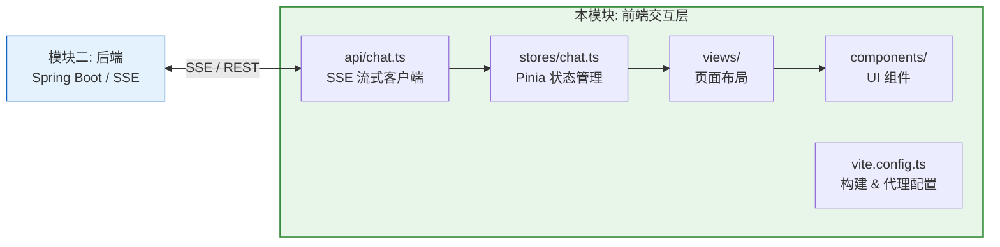
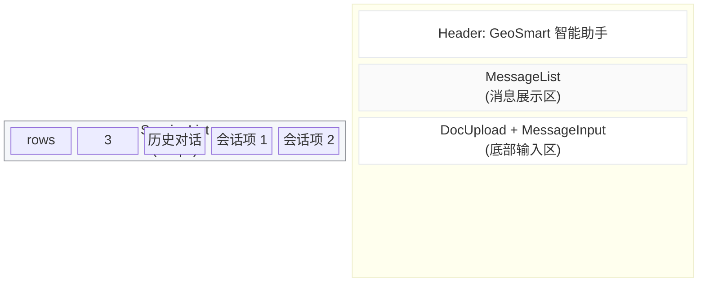
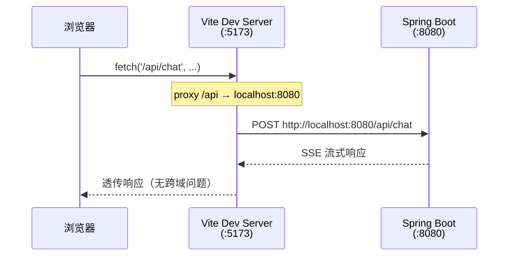
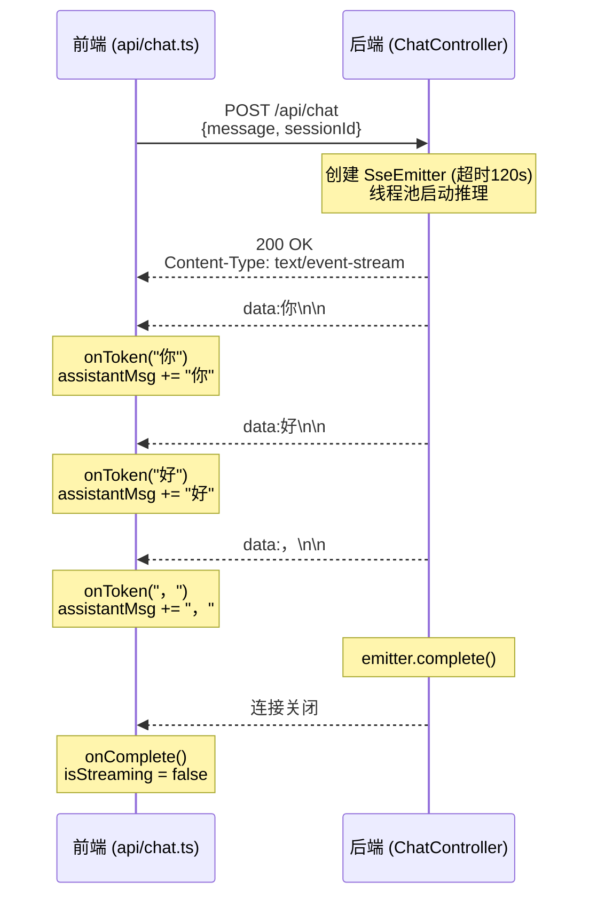
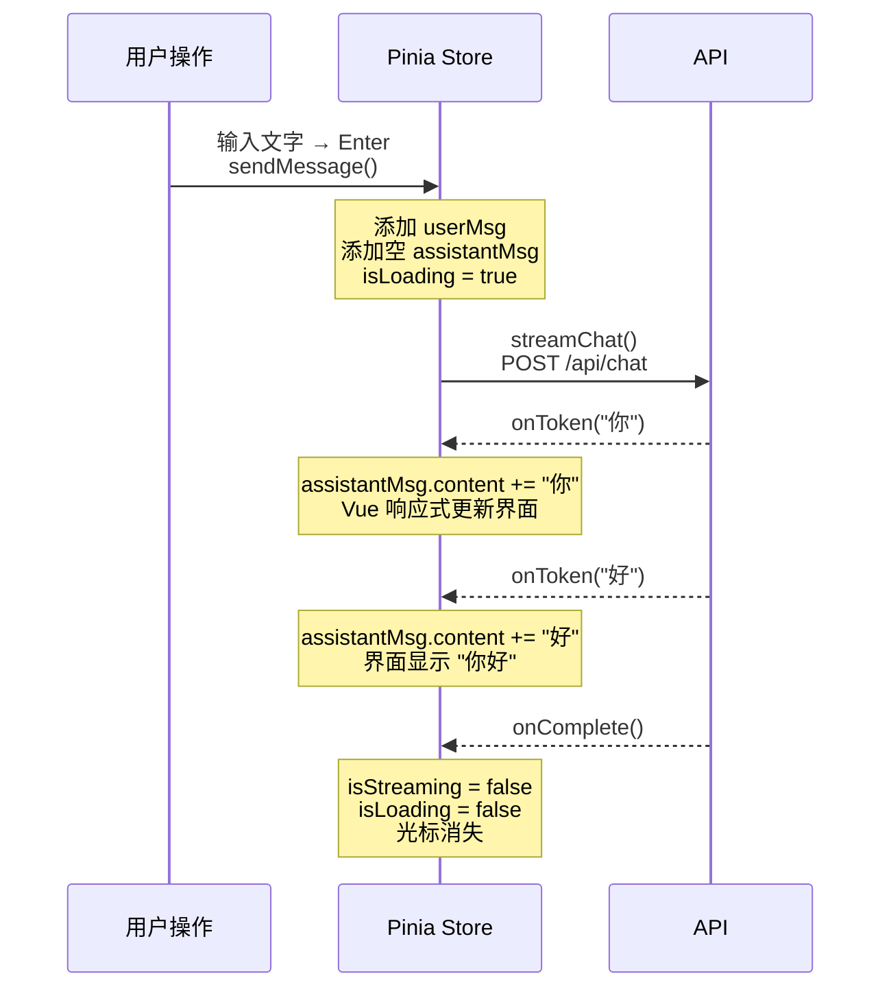

# 模块三：前端交互与工程化优化 — 学习指南

本模块实现用户交互层：Vue 3 组合式组件设计、Pinia 集中式状态管理、SSE 流式客户端、Element Plus UI、Vite 工程化配置。

---

## 目录

1. [模块总览](#1-模块总览)
2. [前置知识](#2-前置知识)
3. [源码详解 — 应用入口](#3-源码详解--应用入口)
4. [源码详解 — API 客户端层](#4-源码详解--api-客户端层)
5. [源码详解 — 状态管理层](#5-源码详解--状态管理层)
6. [源码详解 — 组件层](#6-源码详解--组件层)
7. [源码详解 — 工程化配置](#7-源码详解--工程化配置)
8. [前后端协作全景](#8-前后端协作全景)
9. [动手练习](#9-动手练习)
10. [扩展方向](#10-扩展方向)

---

## 1. 模块总览

### 模块定位



### 涉及文件

| 文件 | 路径 | 职责 |
|------|------|------|
| `main.ts` | `src/` | 应用入口：创建 Vue 实例、注册插件 |
| `App.vue` | `src/` | 根组件：全局样式 |
| `router/index.ts` | `src/router/` | 路由配置 |
| `api/chat.ts` | `src/api/` | SSE 流式通信、文档上传 API |
| `stores/chat.ts` | `src/stores/` | Pinia 集中状态管理 |
| `ChatView.vue` | `src/views/` | 主页面布局 |
| `SessionList.vue` | `src/components/` | 会话列表侧边栏 |
| `MessageList.vue` | `src/components/` | 消息展示区 |
| `MessageInput.vue` | `src/components/` | 输入框 |
| `DocUpload.vue` | `src/components/` | 文档上传 |
| `vite.config.ts` | 根目录 | Vite 构建 + 开发代理配置 |
| `package.json` | 根目录 | 依赖与脚本 |

### 技术栈一览

| 技术 | 版本 | 用途 |
|------|------|------|
| Vue | 3.5 | 响应式 UI 框架（组合式 API） |
| TypeScript | ~6.0 | 类型安全 |
| Vite | 8 | 构建工具 + 开发服务器 |
| Element Plus | 2.13 | UI 组件库 |
| Pinia | 3.0 | 状态管理 |
| Vue Router | 5.0 | 路由 |
| markdown-it | 14.1 | Markdown 渲染 |

---

## 2. 前置知识

### 2.1 Vue 3 组合式 API

项目使用 `<script setup>` 语法糖，这是 Vue 3 推荐的写法：

```vue
<!-- 选项式 API (旧写法) -->
<script>
export default {
  data() { return { count: 0 } },
  methods: { increment() { this.count++ } }
}
</script>

<!-- 组合式 API + <script setup> (新写法，项目使用) -->
<script setup lang="ts">
import { ref } from 'vue'

const count = ref(0)            // 响应式变量
function increment() { count.value++ }  // 直接修改
</script>

<template>
  <button @click="increment">{{ count }}</button>
</template>
```

**核心 API**：

| API | 作用 | 示例 |
|-----|------|------|
| `ref()` | 创建响应式基本类型 | `const name = ref('')` |
| `computed()` | 创建计算属性 | `const double = computed(() => count.value * 2)` |
| `watch()` | 监听变化 | `watch(count, (newVal) => { ... })` |
| `onMounted()` | 生命周期钩子 | `onMounted(() => { ... })` |

### 2.2 Pinia 状态管理

Pinia 是 Vue 3 的官方状态管理库（Vuex 的继任者）。项目使用**函数式 Store**：

```typescript
// 定义 Store
export const useChatStore = defineStore('chat', () => {
  const count = ref(0)               // state
  const double = computed(() => ...)  // getter
  function increment() { count.value++ }  // action
  return { count, double, increment }
})

// 在组件中使用
const store = useChatStore()
console.log(store.count)  // 直接访问
store.increment()         // 直接调用
```

### 2.3 SSE 在浏览器中的处理

浏览器原生支持 SSE（`EventSource` API），但它仅支持 GET 请求。项目使用 `fetch()` + `ReadableStream` 来支持 POST 请求的 SSE：

```
EventSource (浏览器原生):
  - 仅 GET 请求
  - 自动重连
  - 不支持自定义 Header

fetch + ReadableStream (项目使用):
  ✓ 支持 POST 请求（可发送 body）
  ✓ 可自定义 Header
  ✓ 手动控制读取节奏
  ✗ 需要手动解析 SSE 格式
```

---

## 3. 源码详解 — 应用入口

### 3.1 main.ts — 应用初始化

**文件**: `frontend/src/main.ts`

```typescript
import { createApp } from 'vue'
import { createPinia } from 'pinia'
import ElementPlus from 'element-plus'
import 'element-plus/dist/index.css'

import App from './App.vue'
import router from './router'

const app = createApp(App)

app.use(createPinia())   // ① 注册 Pinia（状态管理）
app.use(router)           // ② 注册 Vue Router
app.use(ElementPlus)      // ③ 注册 Element Plus（UI 组件库）

app.mount('#app')         // ④ 挂载到 DOM
```

**插件注册顺序**：
- `Pinia` 先于其他插件，因为组件中可能立即使用 store
- `ElementPlus` 全局注册，所有组件可直接使用 `<el-button>` 等
- `import 'element-plus/dist/index.css'` 全量引入样式（生产可按需引入优化）

### 3.2 App.vue — 根组件

**文件**: `frontend/src/App.vue`

```vue
<template>
  <router-view />   <!-- 路由出口：渲染当前路由对应的组件 -->
</template>

<style>
/* 全局重置样式 */
* { margin: 0; padding: 0; box-sizing: border-box; }
html, body, #app { height: 100%; }
</style>
```

### 3.3 router/index.ts — 路由配置

**文件**: `frontend/src/router/index.ts`

```typescript
import { createRouter, createWebHistory } from 'vue-router'
import ChatView from '@/views/ChatView.vue'

const router = createRouter({
  history: createWebHistory(import.meta.env.BASE_URL),
  routes: [
    {
      path: '/',         // 根路径
      name: 'chat',
      component: ChatView  // 直接渲染 ChatView（无懒加载）
    }
  ]
})
```

**说明**：当前只有一个路由（单页应用）。后续可扩展：
- `/chat` → 聊天页面
- `/documents` → 文档管理页面
- `/settings` → 设置页面

---

## 4. 源码详解 — API 客户端层

### 4.1 api/chat.ts — SSE 流式通信

**文件**: `frontend/src/api/chat.ts`

这是前端最核心的通信模块：

```typescript
export function streamChat(
  request: ChatRequest,              // {message, sessionId}
  onToken: (token: string) => void,  // 每收到一个 token 的回调
  onComplete: () => void,            // 流结束回调
  onError: (error: Error) => void    // 错误回调
): AbortController {                 // 返回中断控制器
```

**完整流程解析**：

```typescript
export function streamChat(...): AbortController {
  const controller = new AbortController()  // ① 创建中断控制器

  fetch('/api/chat', {                      // ② 发起 POST 请求
    method: 'POST',
    headers: { 'Content-Type': 'application/json' },
    body: JSON.stringify(request),
    signal: controller.signal               // ③ 绑定中断信号
  })
    .then(async (response) => {
      const reader = response.body!.getReader()  // ④ 获取流读取器
      const decoder = new TextDecoder()           // ⑤ 二进制 → 文本解码器
      let buffer = ''                             // ⑥ 缓冲区（处理不完整行）

      while (true) {
        const { done, value } = await reader.read()  // ⑦ 读取一块数据
        if (done) break

        buffer += decoder.decode(value, { stream: true })

        // ⑧ 按 \n 分割，处理完整的行
        const lines = buffer.split('\n')
        buffer = lines.pop() || ''  // 最后一段可能不完整，留到下次

        for (const line of lines) {
          if (line.startsWith('data:')) {
            const data = line.substring(5)     // 去掉 "data:" 前缀
            if (data.trim() === '[DONE]') {    // 结束标记
              onComplete()
            } else {
              onToken(data)                    // 传递 token 给回调
            }
          }
        }
      }
      onComplete()  // 流自然结束时也触发完成
    })
    .catch((err) => {
      if (err.name !== 'AbortError') {  // 用户主动中断不算错误
        onError(err)
      }
    })

  return controller  // ⑨ 返回控制器，调用方可中断流
}
```

**SSE 数据流示例**：

```
后端发送 →                    前端接收并解析:
                              buffer = ""
data:今\n                     → lines = ["data:今"]
data:天\n                     → onToken("今")
data:天气\n                   → onToken("天")
data:[DONE]\n                 → onToken("天气")
                              → onComplete()
```

**buffer 的作用**：网络传输可能把多条 SSE 消息合并成一次 `read()` 返回，也可能把一条消息拆成两次。buffer 保证只处理完整的行。

### 4.2 文档上传与列表 API

```typescript
export async function uploadDocument(file: File) {
  const formData = new FormData()
  formData.append('file', file)

  const response = await fetch('/api/documents/upload', {
    method: 'POST',
    body: formData  // FormData 自动设置 Content-Type: multipart/form-data
  })

  if (!response.ok) throw new Error(`Upload failed: ${response.statusText}`)
  return response.json()
}

export async function listDocuments() {
  const response = await fetch('/api/documents')
  return response.json()
}
```

---

## 5. 源码详解 — 状态管理层

### 5.1 stores/chat.ts — Pinia Store

**文件**: `frontend/src/stores/chat.ts`

这是前端的"大脑"，管理所有聊天状态：

```typescript
export const useChatStore = defineStore('chat', () => {
  // ============ 状态 (State) ============
  const sessions = ref<ChatSession[]>([])        // 所有会话列表
  const currentSessionId = ref<string>('')        // 当前选中会话
  const messages = ref<Map<string, ChatMessage[]>>(  // 会话 → 消息映射
    new Map()
  )
  const isLoading = ref(false)                    // 是否正在生成
  let abortController: AbortController | null = null  // 中断控制器（非响应式）

  // ============ 计算属性 (Getter) ============
  const currentMessages = computed(() => {
    return messages.value.get(currentSessionId.value) || []
  })

  // ============ 方法 (Action) ============
```

**数据模型**：

```typescript
// types.ts 中的类型定义（推断）
interface ChatSession {
  id: string
  title: string
  createdAt: number
  lastMessageAt: number
}

interface ChatMessage {
  id: string
  role: 'user' | 'assistant'
  content: string
  timestamp: number
  isStreaming?: boolean  // 是否正在流式输出
}
```

**会话管理方法**：

```typescript
  function createSession(): string {
    const id = generateId()              // 时间戳 + 随机字符串
    const session: ChatSession = {
      id,
      title: '新对话',
      createdAt: Date.now(),
      lastMessageAt: Date.now()
    }
    sessions.value.unshift(session)      // 新会话排在最前面
    messages.value.set(id, [])           // 初始化空消息列表
    currentSessionId.value = id          // 切换到新会话
    return id
  }

  function selectSession(id: string) {
    currentSessionId.value = id          // 切换当前会话
  }
```

**消息发送方法（核心）**：

```typescript
  function sendMessage(content: string) {
    // ① 确保有活动会话
    if (!currentSessionId.value) {
      createSession()
    }
    const sessionId = currentSessionId.value

    // ② 添加用户消息
    const userMsg: ChatMessage = {
      id: generateId(),
      role: 'user',
      content,
      timestamp: Date.now()
    }
    const current = messages.value.get(sessionId) || []
    messages.value.set(sessionId, [...current, userMsg])

    // ③ 更新会话标题（取首条消息前 20 字）
    const session = sessions.value.find((s) => s.id === sessionId)
    if (session && current.length === 0) {
      session.title = content.substring(0, 20) +
        (content.length > 20 ? '...' : '')
    }

    // ④ 创建空的助手消息（占位）
    const assistantMsg: ChatMessage = {
      id: generateId(),
      role: 'assistant',
      content: '',
      timestamp: Date.now(),
      isStreaming: true                   // 标记为流式中
    }
    messages.value.set(sessionId,
      [...(messages.value.get(sessionId) || []), assistantMsg])
    isLoading.value = true

    // ⑤ 发起 SSE 流式请求
    abortController = streamChat(
      { message: content, sessionId },

      // onToken: 追加内容到助手消息
      (token) => {
        const msgs = messages.value.get(sessionId) || []
        const last = msgs[msgs.length - 1]
        if (last && last.role === 'assistant') {
          last.content += token
          // 触发 Vue 响应式更新（创建新数组引用）
          messages.value.set(sessionId, [...msgs])
        }
      },

      // onComplete: 标记流式结束
      () => {
        const msgs = messages.value.get(sessionId) || []
        const last = msgs[msgs.length - 1]
        if (last && last.role === 'assistant') {
          last.isStreaming = false
          messages.value.set(sessionId, [...msgs])
        }
        isLoading.value = false
      },

      // onError: 显示错误信息
      (error) => {
        const msgs = messages.value.get(sessionId) || []
        const last = msgs[msgs.length - 1]
        if (last && last.role === 'assistant') {
          last.content = `错误: ${error.message}`
          last.isStreaming = false
          messages.value.set(sessionId, [...msgs])
        }
        isLoading.value = false
      }
    )
  }

  function stopStreaming() {
    abortController?.abort()     // 中断 fetch 请求
    isLoading.value = false
  }
```

**状态流转图**：

```
sendMessage("你好")
    │
    ├─→ sessions: 新增会话 (如果是首次)
    ├─→ messages: [..., {role:"user", content:"你好"}]
    ├─→ messages: [..., {role:"assistant", content:"", isStreaming:true}]
    │
    │   onToken("你")
    ├─→ messages: [..., {role:"assistant", content:"你", isStreaming:true}]
    │
    │   onToken("好")
    ├─→ messages: [..., {role:"assistant", content:"你好", isStreaming:true}]
    │
    │   onComplete()
    ├─→ messages: [..., {role:"assistant", content:"你好", isStreaming:false}]
    │
    └─→ isLoading: false
```

---

## 6. 源码详解 — 组件层

### 6.1 ChatView.vue — 主页面布局

**文件**: `frontend/src/views/ChatView.vue`

```vue
<template>
  <el-container class="chat-container">
    <el-aside width="260px" class="sidebar">
      <SessionList />              <!-- 左侧会话列表 -->
    </el-aside>
    <el-container>
      <el-header class="chat-header">
        <h2>GeoSmart 智能助手</h2>  <!-- 顶栏 -->
      </el-header>
      <el-main class="chat-main">
        <MessageList />             <!-- 中间消息区 -->
      </el-main>
      <el-footer height="auto" class="chat-footer">
        <DocUpload />               <!-- 文档上传 -->
        <MessageInput />            <!-- 底部输入框 -->
      </el-footer>
    </el-container>
  </el-container>
</template>
```

**布局结构**：



### 6.2 SessionList.vue — 会话列表

**文件**: `frontend/src/components/SessionList.vue`

```vue
<script setup lang="ts">
import { useChatStore } from '@/stores/chat'
const chatStore = useChatStore()

// 组件加载时，如果没有会话则自动创建一个
if (chatStore.sessions.length === 0) {
  chatStore.createSession()
}
</script>

<template>
  <div class="session-list">
    <div class="session-header">
      <span>历史对话</span>
      <el-button type="primary" size="small"
        @click="chatStore.createSession()">
        新建
      </el-button>
    </div>
    <div class="session-items">
      <div v-for="session in chatStore.sessions"
           :class="['session-item',
             { active: session.id === chatStore.currentSessionId }]"
           @click="chatStore.selectSession(session.id)">
        <span class="session-title">{{ session.title }}</span>
      </div>
    </div>
  </div>
</template>
```

**要点**：
- 直接使用 `chatStore` 的状态和方法，无需 props/events 传递
- `:class` 绑定动态类名（active 高亮选中会话）
- `v-for` 遍历 `chatStore.sessions` 响应式渲染

### 6.3 MessageList.vue — 消息展示

**文件**: `frontend/src/components/MessageList.vue`

```vue
<script setup lang="ts">
import { ref, watch, nextTick } from 'vue'
import { useChatStore } from '@/stores/chat'
import MarkdownIt from 'markdown-it'

const chatStore = useChatStore()
const listRef = ref<HTMLElement>()

// Markdown 渲染器配置
const md = new MarkdownIt({
  html: false,     // 禁止 HTML 标签（安全）
  linkify: true,   // 自动识别 URL
  breaks: true     // 换行符转为 <br>
})

function renderMarkdown(content: string): string {
  return md.render(content)
}

// 自动滚动到底部
function scrollToBottom() {
  nextTick(() => {              // 等 DOM 更新后再滚动
    if (listRef.value) {
      listRef.value.scrollTop = listRef.value.scrollHeight
    }
  })
}

// 监听消息数量变化 → 滚动到底部
watch(() => chatStore.currentMessages.length, scrollToBottom)
// 监听最后一条消息内容变化 → 滚动到底部（流式更新时）
watch(
  () => chatStore.currentMessages[
    chatStore.currentMessages.length - 1]?.content,
  scrollToBottom
)
</script>
```

**模板渲染逻辑**：

```vue
<!-- 空状态提示 -->
<div v-if="chatStore.currentMessages.length === 0" class="empty-state">
  <p>欢迎使用 GeoSmart 智能助手</p>
</div>

<!-- 消息列表 -->
<div v-for="msg in chatStore.currentMessages"
     :class="['message', msg.role]">
  <div class="message-avatar">
    {{ msg.role === 'user' ? '我' : 'AI' }}
  </div>
  <div class="message-content">
    <!-- 助手消息用 Markdown 渲染 -->
    <div v-if="msg.role === 'assistant'"
         class="markdown-body"
         v-html="renderMarkdown(msg.content)">
    </div>
    <!-- 用户消息纯文本 -->
    <div v-else>{{ msg.content }}</div>

    <!-- 流式光标动画 -->
    <span v-if="msg.isStreaming" class="streaming-cursor">|</span>
  </div>
</div>
```

**样式设计要点**：
- 用户消息右对齐（`flex-direction: row-reverse`），蓝色气泡
- AI 消息左对齐，白色气泡带边框
- 光标闪烁动画（`@keyframes blink`）
- Markdown 代码块样式（`pre` / `code`）

### 6.4 MessageInput.vue — 输入框

**文件**: `frontend/src/components/MessageInput.vue`

```vue
<script setup lang="ts">
import { ref } from 'vue'
import { useChatStore } from '@/stores/chat'

const chatStore = useChatStore()
const inputText = ref('')

function handleKeydown(e: KeyboardEvent) {
  if (e.key === 'Enter' && !e.shiftKey) {  // Enter 发送
    e.preventDefault()                       // 阻止默认换行
    handleSend()
  }
  // Shift+Enter → 默认换行行为（不拦截）
}

function handleSend() {
  if (chatStore.isLoading) {
    chatStore.stopStreaming()   // 正在生成时 → 停止
    return
  }
  const text = inputText.value.trim()
  if (!text) return
  chatStore.sendMessage(text)
  inputText.value = ''          // 清空输入框
}
</script>
```

**交互逻辑**：
- 按钮文字根据状态切换：`isLoading ? '停止' : '发送'`
- Enter 发送、Shift+Enter 换行（符合聊天工具通用习惯）
- 生成中点击按钮 → 调用 `stopStreaming()` 中断请求

### 6.5 DocUpload.vue — 文档上传

**文件**: `frontend/src/components/DocUpload.vue`

```vue
<script setup lang="ts">
import { ref } from 'vue'
import { uploadDocument } from '@/api/chat'
import type { UploadFile } from 'element-plus'

const uploading = ref(false)
const uploadSuccess = ref(false)
const uploadError = ref('')

async function handleFileChange(file: UploadFile) {
  if (!file.raw) return

  uploading.value = true
  try {
    await uploadDocument(file.raw)
    uploadSuccess.value = true
    setTimeout(() => (uploadSuccess.value = false), 3000)  // 3秒后隐藏提示
  } catch (e: any) {
    uploadError.value = e.message || '上传失败'
    setTimeout(() => (uploadError.value = ''), 5000)        // 5秒后隐藏错误
  } finally {
    uploading.value = false
  }
}
</script>
```

**Element Plus Upload 组件配置**：
- `:auto-upload="false"` — 选择文件后不自动上传，由 `on-change` 手动处理
- `:show-file-list="false"` — 不显示文件列表（自定义显示状态）
- `accept=".txt,.pdf,.docx,.doc"` — 限制文件类型

---

## 7. 源码详解 — 工程化配置

### 7.1 vite.config.ts — 构建与代理

**文件**: `frontend/vite.config.ts`

```typescript
export default defineConfig({
  plugins: [vue()],
  resolve: {
    alias: {
      '@': fileURLToPath(new URL('./src', import.meta.url))
      // '@' → 'src/' 目录的绝对路径
      // 允许用 import ... from '@/stores/chat' 代替相对路径
    }
  },
  server: {
    host: '0.0.0.0',    // 监听所有网络接口（局域网可访问）
    port: 5173,          // 开发服务器端口
    proxy: {
      '/api': {
        target: 'http://localhost:8080',  // 后端地址
        changeOrigin: true                // 修改请求头 Origin
      }
      // 效果：前端 /api/chat → http://localhost:8080/api/chat
      // 开发时避免跨域问题
    }
  }
})
```

**代理工作原理**：



### 7.2 package.json — 脚本与依赖

**文件**: `frontend/package.json`

```json
{
  "scripts": {
    "dev": "vite",                                    // 开发服务器
    "build": "run-p type-check \"build-only {@}\" --", // 类型检查 + 构建并行
    "preview": "vite preview",                        // 预览生产构建
    "type-check": "vue-tsc --build",                  // TypeScript 类型检查
    "lint": "run-s lint:*",                           // 按顺序运行所有 lint
    "lint:oxlint": "oxlint . --fix",                  // 快速 lint (Oxlint)
    "lint:eslint": "eslint . --fix --cache"           // 深度 lint (ESLint)
  }
}
```

**脚本说明**：
- `npm run dev` — 启动开发服务器（HMR 热更新）
- `npm run build` — 先类型检查再构建，任一失败则中断
- `npm run lint` — 先 Oxlint（快），再 ESLint（全面），自动修复

**Node 版本要求**：`^20.19.0 || >=22.12.0`

---

## 8. 前后端协作全景

### 8.1 SSE 流式通信协议



### 8.2 状态同步图



---

## 9. 动手练习

### 练习 1：运行并理解项目

```bash
# 1. 安装前端依赖
cd frontend && npm install

# 2. 确保后端已启动 (localhost:8080)
cd backend && mvn spring-boot:run

# 3. 启动前端开发服务器
cd frontend && npm run dev

# 4. 打开 http://localhost:5173
# 5. 打开浏览器 DevTools → Network → 找到 /api/chat 请求
#    → EventStream 标签页查看逐条 SSE 数据
```

### 练习 2：为消息添加"复制"按钮

**目标**：练习 Vue 组件交互和 Element Plus 使用。

在 `MessageList.vue` 中：

```vue
<div class="message-content">
  <!-- 助手消息 -->
  <div v-if="msg.role === 'assistant'" class="markdown-body"
       v-html="renderMarkdown(msg.content)">
  </div>
  <div v-else>{{ msg.content }}</div>

  <!-- 复制按钮 -->
  <el-button v-if="!msg.isStreaming && msg.content"
             size="small" text
             @click="copyMessage(msg.content)">
    复制
  </el-button>
</div>
```

```typescript
function copyMessage(content: string) {
  navigator.clipboard.writeText(content)
  ElMessage.success('已复制')
}
```

### 练习 3：添加代码语法高亮

**目标**：增强 Markdown 渲染能力。

```bash
npm install highlight.js
```

```typescript
// MessageList.vue
import MarkdownIt from 'markdown-it'
import hljs from 'highlight.js'

const md = new MarkdownIt({
  html: false,
  linkify: true,
  breaks: true,
  highlight(str, lang) {
    if (lang && hljs.getLanguage(lang)) {
      return hljs.highlight(str, { language: lang }).value
    }
    return ''
  }
})
```

### 练习 4：会话标题自动生成优化

**目标**：当前标题取用户消息前 20 字，优化为首条助手回复的内容摘要。

在 `stores/chat.ts` 的 `onComplete` 回调中：

```typescript
() => {
  // ... 原有逻辑

  // 如果是新会话的第一次回复完成，用 AI 回答生成标题
  const session = sessions.value.find(s => s.id === sessionId)
  if (session && session.title === '新对话') {
    const answer = msgs[msgs.length - 1]?.content || ''
    session.title = answer.substring(0, 30) +
      (answer.length > 30 ? '...' : '')
  }
}
```

### 练习 5：添加暗色主题切换

**目标**：理解 Element Plus 主题系统。

```vue
<!-- App.vue -->
<script setup>
import { ref } from 'vue'

const isDark = ref(false)
function toggleTheme() {
  isDark.value = !isDark.value
  document.documentElement.classList.toggle('dark', isDark.value)
}
</script>

<template>
  <button @click="toggleTheme">
    {{ isDark ? '☀️' : '🌙' }}
  </button>
  <router-view />
</template>
```

### 练习 6：运行代码质量检查

```bash
# TypeScript 类型检查
npm run type-check

# Lint 检查（Oxlint + ESLint）
npm run lint

# 生产构建
npm run build
```

---

## 10. 扩展方向

### 10.1 消息持久化

当前刷新页面消息丢失。使用 `localStorage` 持久化：

```typescript
// stores/chat.ts
import { watchEffect } from 'vue'

// 自动保存到 localStorage
watchEffect(() => {
  const data = {
    sessions: sessions.value,
    messages: Object.fromEntries(messages.value)
  }
  localStorage.setItem('geosmart-chat', JSON.stringify(data))
})

// 初始化时加载
const saved = localStorage.getItem('geosmart-chat')
if (saved) {
  const data = JSON.parse(saved)
  sessions.value = data.sessions
  messages.value = new Map(Object.entries(data.messages))
}
```

### 10.2 路由扩展

```typescript
// router/index.ts
const routes = [
  { path: '/', redirect: '/chat' },
  { path: '/chat', component: ChatView },
  { path: '/documents', component: DocManageView },  // 新增
  { path: '/settings', component: SettingsView },     // 新增
]
```

### 10.3 组件拆分优化

当前 `MessageList.vue` 可进一步拆分：

```
MessageList.vue (容器)
├── EmptyState.vue     (空状态)
├── UserMessage.vue    (用户消息气泡)
└── AssistantMessage.vue (AI 消息气泡)
    └── MarkdownRenderer.vue (Markdown 渲染)
```

### 10.4 生产部署优化

```typescript
// vite.config.ts 生产优化
export default defineConfig({
  build: {
    rollupOptions: {
      output: {
        manualChunks: {
          'element-plus': ['element-plus'],  // 单独打包 UI 库
          'vendor': ['vue', 'pinia', 'vue-router']  // 框架单独打包
        }
      }
    }
  }
})
```

```nginx
# Nginx 生产配置
server {
    listen 80;
    server_name geosmart.example.com;

    # 前端静态文件
    location / {
        root /usr/share/nginx/html;
        try_files $uri $uri/ /index.html;
    }

    # API 代理到后端
    location /api/ {
        proxy_pass http://backend:8080;
        proxy_http_version 1.1;
        proxy_set_header Connection "";
        proxy_buffering off;         # 关键：SSE 不缓冲
        proxy_read_timeout 300s;     # SSE 长连接超时
    }
}
```

### 10.5 可访问性 (a11y) 增强

- 为所有交互元素添加 `aria-label`
- 支持键盘导航（Tab、Escape）
- 屏幕阅读器友好的语义化 HTML
- 对比度检查（WCAG AA 标准）
